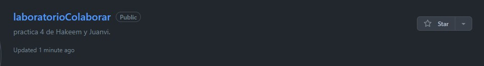
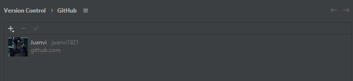
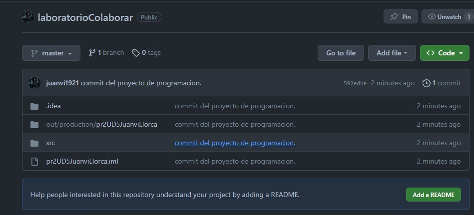
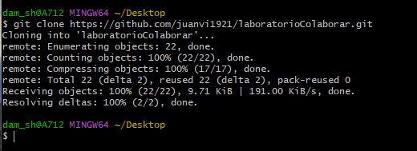
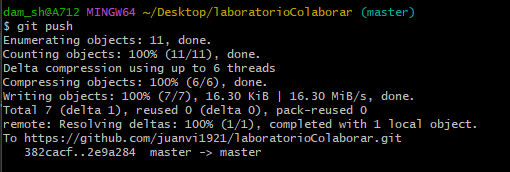
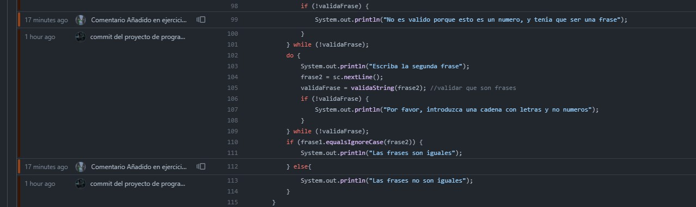

# Practica 4 - Investigación sobre trabajo colaborativo

Esta práctica se realizará por parejas, pero ambos alumnos deberán de entregar el PDF en aules. Se va a trabajar la colaboración en proyectos mediante GitHub.

Nombre Alumno1: Juanvi Llorca Martiínez. 
Nombre Alumno2:  
URL del repositorio: https://github.com/juanvi1921/laboratorioColaborar.git

El alumno 1 deberá rellenar los apartados que aparece A1, y el alumnos 2 en A2.  
Las imágenes y este mismo archiuvo con su versión PDF deberán estar en GitHub.

1. A1: Cread un repositorio "laboratorioColaborar" en GitHub (Ponedlo público).

    

2. A2: Investigad sobre como utilizar GIT desde IntelliJ para explicarlo a A1.
    * Primero hay que conectar intellij con git, vamos primero a File > Settings > Version Control > Git. Ahora donde esta Path to git executable dadle a TEST para pueda buscar automaticamene la version de git que tenemos.
    * Ahora nos dirigimos desde intelliJ File > Settings > Version Control > GitHub y añadiremos una cuenta  via GitHub. Esto abrira una ventana para que puedas autorizar la autentificación. Despues de aceptar si vuelves a intelliJ GitHub ya podras ver que tu cuenta esta vinculada en intelliJ.
    * Luego habria que crear un repositorio en GitHub.
    * Despues de crearlo vuelves a intelliJ  y nos dirigimos a VCS > Create Git Repository..., donde tendras que seleccionar el proyecto que quieres subir.(Esto creara una nueva pestaña llamado git y cuando este creado lo que antes se llamaba VCS ahora se llama Git).
    * Si quieres comprobar que el git se ha creado ve a la direccion del proyecto donde se creo el git y podras mirar si se creo el .git.
    * Ahora realizaremos un commit empezando en Git > Commit... Escribes una breve descripcion y seleccionas los archivos que quieras subir. Cuando todo este listo dadle a commit. (Esto hará que los archivos se añadan a las versiones de controles).
    * Ya cuando el commit este listo vuelve a Git > Push... Esto hara que aparezca una nueva pestaña donde tendras que definir en el master o origin el remote, que es donde añadirias el url de tu repositorio. Cuando añadas el url ya podras hacer el push.
    
    

3. A1: Subid una práctica de "Programación" desde IntelliJ

    

4. A2: Descargad el repositorio de A1.
    
    

5. A2: Haced modificaciones en el código y subidlo mediante IntelliJ.
    * Antes estaba el ejercicio 5 y ahora lo he borrado.
    
    
    * Al final lo hemos subido mediante gitBash
6. A1: Descarga el programa actual y modifica una parte.
7. A2: Modifica la misma parte que A1 de manera que surja un coinflicto

    

8. A1 y A2 : Subid los cambios y resolved el conflicto. ver el ej 7.
9. A1:Investigad sobre la herramienta "CodeWithMe".  
    Es una herramienta de colaboración de JetBrains que permite a los desarrolladores trabajar juntos en tiempo real en los proyectos, es especialmente útil para equipos distribuidos que desean trabajar juntos de manera eficiente. Sus caracteristicas son:
    
    1. Colaboración en tiempo real.
    2. Soporte para multiples lenguajes y entornos.
    3. Acceso remoto seguro.
    4. Funciones de colaboración avanzadas.
    5. Controles de seguridad y privacidad.
    6. Compatibilidad con herramientas de control de versiones.
10. A2: Investigad sobre la herramienta "GitHubCopilot".

Vídeos de ayuda:  
Subir proyecto desde GIT: https://www.youtube.com/watch?v=6WtA2dUDvPY  
Clonar repositorio: https://www.youtube.com/watch?v=rcQBgm5vid0
Colaborar con GIT: https://www.youtube.com/watch?v=ibmQkhAzk5I  

